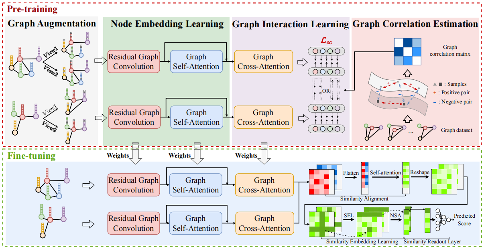

# Exploring Attention and Self-supervised LearningMechanism for Graph Similarity Learning

Graph similarity estimation is a challenging task due to the complex graph structures. Though important and well-studied, three critical aspects are yet to be fully handled in a unified framework: i)how to learn richer cross graph interactions from a pairwise node perspective, ii) how to map the similarity matrix into a similarity score by exploiting the inherent structure in the similarity matrix and iii) how to establish a self-supervised learning mechanism for graph similarity learning. To solve these issues, we explore multiple attention and self-supervised mechanisms for graph similarity learning in this work. More specifically, we propose a unified Self-supervised Node-wise Attention guided Graph Similarity Learning framework (SNA-GSL) involving i) a correlation-guided contrastive learning for capturing valuable node embeddings and ii) a graph similarity learning for predicting similarity scores with multiple proposed attention mechanisms. Extensive experimental results on graphgraph regression task and graph classification task demonstrate that the proposed SNA-GSL performs favorably against state-of-the-art methods. Moreover, the remarkable achievement of our model in the graph classification task is a clear indication of its exceptional generalization capabilities.

